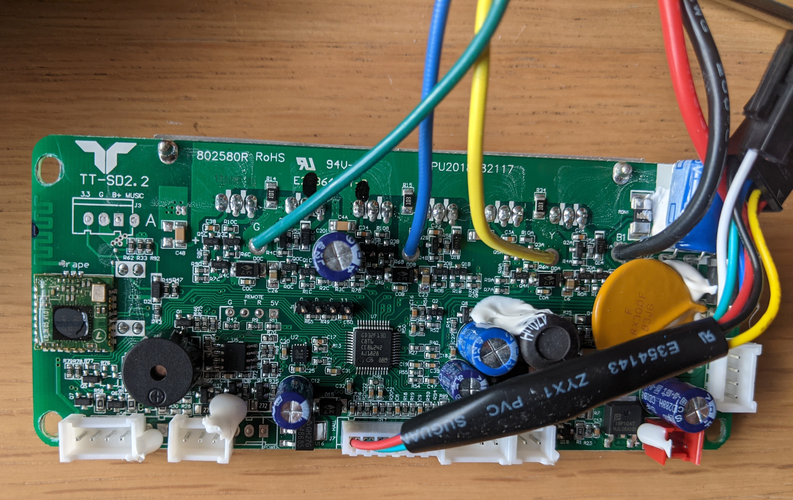
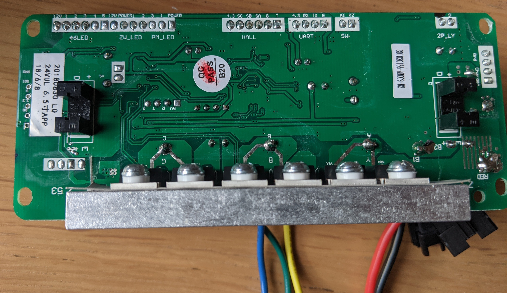
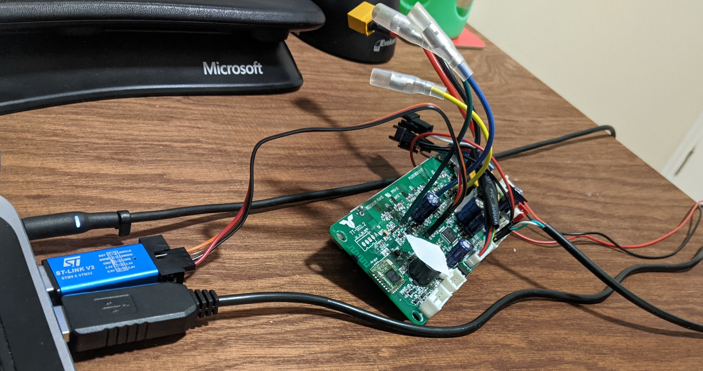
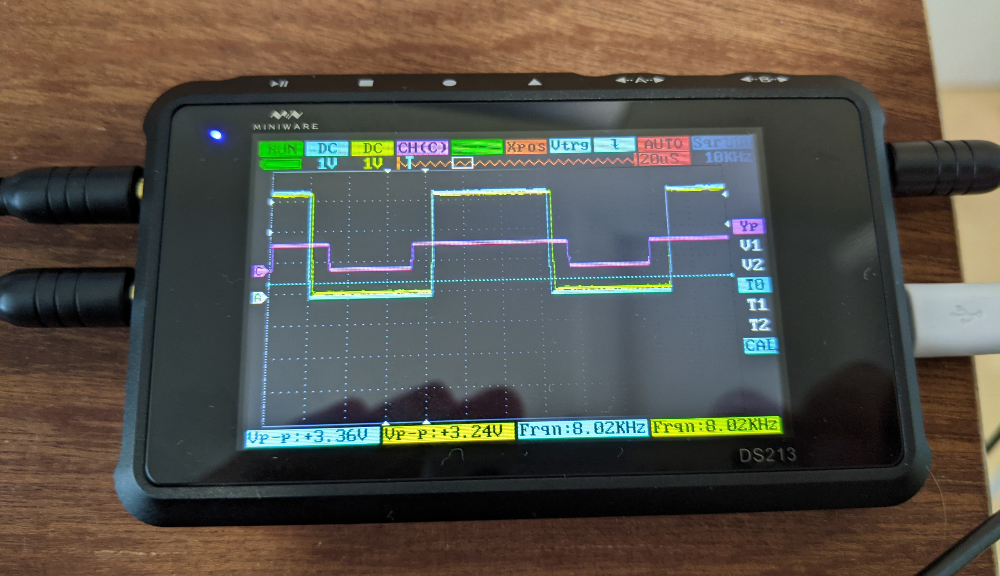

# Flying Kites with Rust

Andrew Walbran

---

# Outline

- Generating power with a kite
- Hardware
- Firmware
- Controlling it
- Next steps

---

# Generating power with a kite

Kite has two strings wound on reels connected to motors, which can also act as generators.

1. Steer kite to centre of wind window.
2. Wind pulls the kite, unwinding the string, generating power.
3. Steer kite to edge of wind window.
4. Wind string back in, using less energy than was generated on the way out.
5. Repeat.

---

# Hardware

What hardware do we need?

1. Two motors
2. Spools to wind the strings on
3. Motor controllers
4. A microcontroller and other electronics to manage the motors
5. A big battery to power it all

Let's take the tires off a hoverboard!

---

# Hoverboard

David bought a "Zinc Smart GT Pro" hoverboard.

These boards have been hacked to make
[DIY mobility devices](https://hackaday.io/project/170932-hoverboards-for-assistive-devices). Their
[firmware](https://github.com/gearsincorg/Hoverboards-for-assistive-devices) is all in C, but served
as useful documentation and inspiration. They also have some
[circuit diagrams and pinouts](https://github.com/gearsincorg/Hoverboards-for-assistive-devices/blob/master/Hoverboard/Documents/Schematic_CoolAndFun.pdf)
which were very useful.

---



---



---

# Hoverboard boards

Each half has an almost-identical "TT-SD2.2" board with:

- A GD32F130C8 microcontroller.
- 6 power MOSFETs to drive the three phase brushless DC motor, and 3 hall effect sensors to sense
  its position.
- A BMI160 6-axis IMU (accelerometer & gyroscope).
- Opto-interruptors to sense someone standing on the hoverboard.
- Two UARTs.
- Some LEDs.
- Battery voltage measurement.
- Motor current measurement.
- A power button.
- An (unpopulated) SWD header.

One half also has a piezo speaker, a battery charger connection, and a Bluetooth module. The only
connections between the two halves are power, and a serial connection between the UARTs for
communication.

---

# Hardware hacking

We removed the tires from the hoverboard wheels so they could serve as spools, and soldered headers
onto the SWD port and second serial port.

Connect an ST-Link V2 SWD debugger, and we're in! First step, disable the watchdog timer:

```sh
openocd -f interface/stlink-v2.cfg -f target/stm32f1x.cfg -c init \
  -c "reset halt; stm32f1x options_write 0 SWWDG"
```

---



A USB serial adapter is handy too.

???

We stuck some tape on the piezo speaker as it was too loud.

---

# Time to write some firmware

It would be easiest to write it in C with PlatformIO and the official GigaDevice headers, based on
the existing assistive devices code we found...

--

Let's not do that.

---

# Embedded Rust

- Peripheral Access Crate: mostly-safe access to memory-mapped peripheral registers, autogenerated
  from CMSIS-SVD files by `svd2rust`.
- HAL crate: higher level wrappers around various peripherals, generally implementing traits from
  `embedded-hal`.

The [`stm32-rs`](https://github.com/stm32-rs/) project has PAC and HAL crates for many STM32
microcontrollers, including [`stm32f1xx-hal`](https://crates.io/crates/stm32f1xx-hal). Let's try
that.

A GD32F130 is almost the same as an STM32F130, right?

--

Nope. Some basic peripherals are more or less the same, but many are significantly different.

---

# Time to write a PAC

Found `GD32F1x0.svd` on GigaDevice's website, along with the
[datasheet](https://www.gigadevice.com.cn/Public/Uploads/uploadfile/files/20230314/GD32F130xxDatasheetRev3.7.pdf)
(79 page PDF) and
[user manual](https://www.gigadevice.com.cn/Public/Uploads/uploadfile/files/20230209/GD32F1x0_User_Manual_EN_Rev3.6.pdf)
(702 page PDF).

Added lots of patches with svdtools, e.g.:

```yaml
"I2C*":
  CTL0:
    SRESET:
      NotReset: [0, "I2C peripheral not under reset"]
      Reset: [1, "I2C peripheral under reset"]
    SALT:
      Release: [0, "SMBA pin released high"]
      Drive: [1, "SMBA pin driven low"]
    PECTRANS:
      Disabled: [0, "No PEC transfer"]
      Enabled: [1, "PEC transfer"]
  SADDR1:
    ADDRESS2: [0, 0x7F]
    DUADEN:
      Single: [0, "Single addressing mode"]
      Dual: [1, "Dual addressing mode"]
```

Released [`gd32f1`](https://crates.io/crates/gd32f1), supporting GD32F130, FD32F150, GD32F170 and
GD32F190.

???

User manual documents all the peripherals and their registers. The SVD file has some of the same
information (namely the addresses of registers and field names), but has some mistakes and is
missing many details (e.g. enum variant names, valid ranges for values). Adding these in results in
a more usable generated PAC crate. Lots of tedious reading of user manual to write patches for
peripherals I care about. The snippet above is a small part of the patch for the I2C peripherals.

Initially tried sending patches to add support for the GD32F1x0 this to the existing `stm32-rs`
project, but they said it was out of scope. Instead forked to new
[gd32-rs](https://github.com/gd32-rust/gd32-rs) repository, keeping their setup for building and
testing crates, and generating a bunch of useful [HTML pages](https://gd32-rust.github.io/gd32-rs/).

The datasheet has pinouts and specifications (RAM and flash size, numbers of various peripherals)
for all the different variants of the GD32F130 family, along with packaging and electrical
characteristics. GD32F150 and so on have their own datasheets.

---

# HAL time

Forked from `stm32f1xx-hal`, as some peripherals are similar.

```rust
use crate::{pac::FWDGT, time::MilliSeconds};
use embedded_hal::watchdog::{Watchdog, WatchdogEnable};

pub struct FreeWatchdog {
  fwdgt: FWDGT,
}

impl WatchdogEnable for FreeWatchdog {
  type Time = MilliSeconds;

  fn start<T: Into<Self::Time>>(&mut self, period: T) {
    self.setup(period.into().0);

    self.fwdgt.ctl.write(|w| w.cmd().start());
  }
}

impl Watchdog for FreeWatchdog {
  fn feed(&mut self) {
    self.fwdgt.ctl.write(|w| w.cmd().reset());
  }
}
```

???

- Free watchdog timer: this is probably the simplest module of the HAL.
- Watchdog will reset the MCU if it is not fed for more than the given period of time.
- `FWDGT` is the free watchdog peripheral from the PAC, which gives us access to the registers.
- Taking ownership of `FWDGT` gives us unique access to the peripheral registers, as the PAC only
  allows one instance of each peripheral to exist. (It doesn't implement `Clone`.)
- I've omitted `FreeWatchdog::setup` and some other methods which were too long to fit on the slide.
- Type state pattern is used a fair bit for setting up peripherals.
- Lots of (declarative) macros, for similar types and implementations where generics don't work.

---

# Initialisation

```rust
#[entry]
fn main() -> ! {
  let mut cp = cortex_m::Peripherals::take().unwrap();
  let dp = pac::Peripherals::take().unwrap();

  let mut rcu = dp.RCU.constrain();
  let mut flash = dp.FMC.constrain();
  let clocks = rcu.cfgr.sysclk(72.mhz()).adcclk(12.mhz()).freeze(&mut flash.ws);

  let mut watchdog = FreeWatchdog::new(dp.FWDGT);
  watchdog.start(WATCHDOG_MILLIS.ms());

  let systick = SysTick::start(cp.SYST, &clocks);

  let mut hoverboard = Hoverboard::new(dp.GPIOA, dp.TIMER0, &mut rcu.apb1,
                                       clocks, ...);

  // More initialisation...

  loop {
    watchdog.feed();

    // Process events...
  }
}
```

???

- `Peripherals::take()` returns a struct containing the PAC representations of all peripherals. If
  you call it a second time it returns `None`, to prevent multiple references to the same registers
  existing.
- `constrain()` comes from extension traits which essentially convert the PAC type into the HAL
  type.
- `SysTick` gives us a clock, so we can measure time durations.

---

# Abstraction

Let's make a wrapper for the peripherals on the hoverboard.

```rust
pub struct Hoverboard {
  pub serial_rx: Rx<USART1>,
  pub serial_writer: BufferedSerialWriter<Tx<USART1>>,
  pub imu: Bmi160<I2cInterface<
      BlockingI2c<I2C0, PB8<Alternate<AF1>>, PB9<Alternate<AF1>>>>>,
  pub buzzer: Buzzer,
  pub power_latch: PB2<Output<PushPull>>,
  /// This will be high when the power button is pressed.
  pub power_button: PC15<Input<Floating>>,
  pub leds: Leds,
  // More fields...
}
```

???

- `Bmi160` comes from another library, which gives us access to the IMU over I2C.
- `Leds` is a struct with appropriately named fields for the various LEDs connected to GPIO pins.
- `Buzzer` is a small wrapper around the PWM module from the HAL, which uses a timer to drive the
  piezo speaker at a given frequency.
- There are more fields for the other USART, charge state, and some configuration.
- There is also a struct representing the motor, but it is stored in a static variable inside a
  `Mutex` because it needs to be accessed from interrupt handlers.

---

# BLDC motor driver


???

- Three motor windings connected between pairs of MOSFETs, like an H-bridge with an extra leg.
- Each leg can be driven high, driven low, or undriven.

---

# BLDC motor control

| Position | Sensor values | Forwards | Backwards |
| -------- | ------------- | -------- | --------- |
| 0        | `0 0 1`       | `0 + -`  | `0 - +`   |
| 1        | `1 0 1`       | `- + 0`  | `+ - 0`   |
| 2        | `1 0 0`       | `- 0 +`  | `+ 0 -`   |
| 3        | `1 1 0`       | `0 - +`  | `0 + -`   |
| 4        | `0 1 0`       | `+ - 0`  | `- + 0`   |
| 5        | `0 1 1`       | `+ 0 -`  | `- 0 +`   |

???

- We have three Hall effect sensors connected to digital inputs, and three motor windings.
- We drive all the motor connections from a single PWM unit, configured to use a different duty
  cycle for each pair of outputs.
- '0' here actually means a 50% duty cycle, '+' means > 50%, '-' means < 50%.
- How much greater or less? That's how we control torque.

---

```rust
impl Motor {
  fn set_position_power(&mut self, power: i16, position: u8) {
    // If power is below a threshold, turn it off entirely.
    if power.abs() < MOTOR_POWER_DEAD_ZONE {
      self.pwm.output_disable();
      return;
    }
    self.pwm.automatic_output_enable();

    let power: i16 = clamp(power, &(-1000..=1000));
    let (y, b, g) = match position {
      0 => (0, power, -power),
      1 => (-power, power, 0),
      2 => (-power, 0, power),
      3 => (0, -power, power),
      4 => (power, -power, 0),
      5 => (power, 0, -power),
      _ => (0, 0, 0),
    };
    let duty_max = self.pwm.get_max_duty();
    let power_max = (duty_max / 2) as i32;
    let y = y as i32 * power_max / 1000;
    let b = b as i32 * power_max / 1000;
    let g = g as i32 * power_max / 1000;
    let y = clamp((y + power_max) as u16, &(10..=duty_max - 10));
    let b = clamp((b + power_max) as u16, &(10..=duty_max - 10));
    let g = clamp((g + power_max) as u16, &(10..=duty_max - 10));
    self.set_duty_cycles(y, b, g);
  }
}
```

???

- This is called regularly from an interrupt handler at 16 kHz.
- To stop driving the motor entirely, we disable the PWM unit to save power. This lets all the motor
  connections float, so it can turn freely.
- Another layer on top of this keeps track of the absolute position of the motor, and applies
  smoothing to move the power slowly towards a target power value to avoid jerky movement.

---

# Debugging electronics



???

- Blue and yellow are control signals for two halves of one channel running at 50% duty cycle.
- Note the slight offset in timing; it's better to have the motor be undriven for a fraction of a
  second than have a short circuit. The PWM hardware is configured to do this automatically.
- Pink is another channel. Scale is different because the scope only has two analogue inputs, this
  is a digital input.

---

# Where to?

What we actually want to do is pull a kite string, so we care about position more than speed.

```rust
if let Some(target_position) = target_position {
  let difference = target_position - position;
  speed = clamp(difference * spring_constant, &speed_limits.into());
} else {
  speed = 0;
}

hoverboard.set_motor_power(speed);
```

???

- Yet another layer sets the target power based on the absolute position and a target position. The
  power is set to the difference times a configured spring constant, capped at a configured power
  limit.
- Experimentally, trying to turn the wheel does indeed feel like a spring!
- We also set the LEDs based on the position difference, to give a visual indication of what's happening.

---

# Talking to a computer (and the other half)

- Each side has two USARTs we can use.
- For ease of use, we connect the 'primary' side to the computer, and the secondary side to the
  primary side. The primary side relays commands to the secondary side.
- Command crate shared between device and controller sides:

```rust
#[derive(Copy, Clone, Debug, Eq, PartialEq)]
pub enum Command {
  SetSideLed(bool),
  SetOrangeLed(bool),
  SetRedLed(bool),
  SetGreenLed(bool),
  AddBuzzerNote(Note),
  ReportBattery,
  ReportCharger,
  SetMaxSpeed(SpeedLimits),
  SetSpringConstant(u16),
  SetTarget(i64),
  RemoveTarget,
  Recenter,
  IncrementTarget,
  DecrementTarget,
  PowerOff,
  TestMotor,
}
```

???

- This can be connected either to a laptop via a USB serial adapter, or directly to a Raspberry Pi.
- Parsing is a big `match` expression, matching on a slice.
- Parsing and serialisation code has plenty of tests, which can be run on the host.

---

# Whoops, I'm a maintainer now
